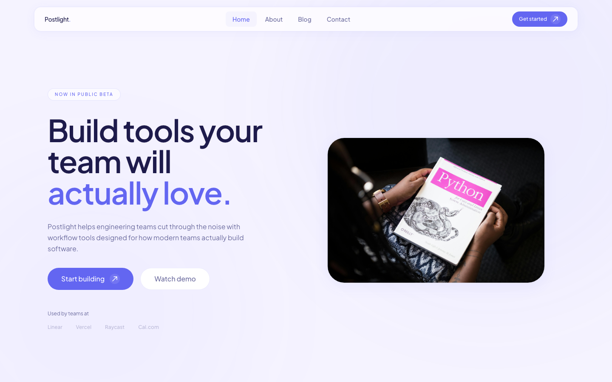
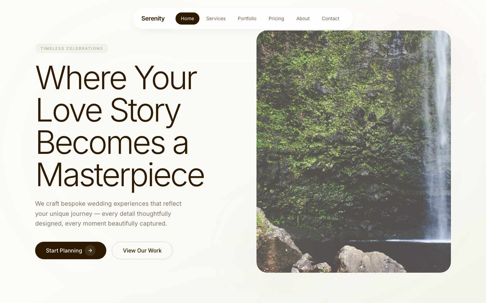

# Frontend Architecture System

Opinionated Frontend Engineering System for scalable AI-based web application development.

**React 19 + TypeScript 5.9 + Vite 7 + Tailwind CSS v4 SPA** — A reusable frontend engineering system designed for scalable AI-assisted development workflows. Use it as a project starter **or** adopt its architecture docs as your engineering foundation.

---

## Two Ways to Use This

### 🆕 Path A — Bootstrap a New Project (From Zero)

**Step 1: Clone this architecture repo**

```bash
git clone <this-repo-url> frontend-os
cd frontend-os
```

**Step 2: Generate your project**

```bash
./.scaffolds/bootstrap.sh my-app
```

This one command does everything:

- Creates a fresh Vite + React + TypeScript project
- Installs all 28+ dependencies (TanStack Query, zustand, RHF, Radix, axios, etc.)
- Configures `vite.config.ts` with `@tailwindcss/vite` plugin + path aliases
- Sets up TypeScript paths, ESLint 9 flat config, Prettier, Husky, lint-staged
- Creates the full `src/` directory structure (shared/, features/, pages/, routes/, etc.)
- Adds working stubs: `AppProvider`, `Router`, `cn()`, axios client, home page
- **Copies the entire architecture system**: `.agent/`, `.architecture/`, `.rules/`, `.templates/`, `.workflows/`, `.docs/`, `.design/`, `core.md`

**Step 3: Start building**

```bash
cd my-app
npm run dev
# Open http://localhost:5173
```

Now prompt the AI:

> "Read `core.md` then load `.agent/feature-generator.md`. Scaffold a `billing` feature."

### 📖 Path B — Adopt the Architecture Into an Existing Project

Use only the docs, rules, agents, and templates as your engineering blueprint:

```bash
cp -r .agent/ .architecture/ .rules/ .templates/ .workflows/ .docs/ core.md your-project/
```

Then follow `.workflows/init.md` to install the matching stack (or adapt to yours). The patterns are stack-agnostic — swap React for Vue, TanStack Query for SWR, etc.

---

## Stack

| Category      | Library                                                         | Version |
| ------------- | --------------------------------------------------------------- | ------- |
| Framework     | React + react-dom                                               | 19      |
| Language      | TypeScript                                                      | 5.9     |
| Bundler       | Vite + @vitejs/plugin-react                                     | 7       |
| Routing       | react-router-dom (SPA, createBrowserRouter)                     | 7       |
| Server state  | @tanstack/react-query + devtools                                | 5       |
| Client state  | zustand (create, devtools, persist)                             | 5       |
| Forms         | react-hook-form + @hookform/resolvers/zod                       | 7       |
| Validation    | zod + zod-i18n-map                                              | 3       |
| Styling       | Tailwind CSS (v4, @tailwindcss/vite)                            | 4       |
| UI primitives | @radix-ui/\* (dialog, dropdown-menu, select, tabs, etc.)        | latest  |
| Icons         | lucide-react                                                    | latest  |
| HTTP          | axios                                                           | 1       |
| Tables        | @tanstack/react-table                                           | 8       |
| i18n          | i18next + react-i18next                                         | 24 / 15 |
| Notifications | sonner (toast, Toaster)                                         | 2       |
| Theme         | next-themes (ThemeProvider, useTheme)                           | 0.4     |
| SEO           | react-helmet-async (Helmet, HelmetProvider)                     | 2       |
| Date          | date-fns                                                        | 4       |
| Cookies       | js-cookie                                                       | 3       |
| OTP input     | input-otp                                                       | latest  |
| Class utils   | class-variance-authority + tailwind-merge + clsx                | latest  |
| Animation     | tw-animate-css                                                  | 1       |
| Font          | @fontsource-variable/inter                                      | latest  |
| Linting       | ESLint 9 (flat config) + Prettier (prettier-plugin-tailwindcss) | latest  |
| Git hooks     | husky 9 + lint-staged                                           | latest  |

---

## Architecture at a Glance

```
.agent/             10 AI agent definitions (prompt any AI assistant)
.architecture/      15 architecture docs (folder, FDD, shared, API, state...)
.rules/             5 enforceable rulesets (scalability, isolation, perf...)
.templates/         8 reusable templates (feature, component, hook, API...)
.workflows/         8 step-by-step engineering workflows (init, review...)
.scaffolds/         4 executable scripts (bootstrap, feature, component, hook)
.docs/              4 documentation guides (getting started, conventions...)
core.md             Central reference — start here
```

## Project Structure (src/)

```
src/
├── shared/                  # Reusable platform (knows nothing about features)
│   ├── ui/                  #   atoms/, molecules/, organisms/
│   ├── lib/                 #   Pure utilities
│   ├── api/                 #   Axios config + base hooks
│   ├── hooks/               #   Generic React hooks
│   ├── utils/               #   cn() via tailwind-merge + clsx
│   ├── types/               #   Domain-agnostic types
│   └── config/              #   App-wide config
├── features/{name}/         # Self-contained modules
│   ├── api/                 #   Axios service functions
│   ├── components/          #   Feature-specific components
│   ├── hooks/               #   TanStack Query hooks
│   ├── types/               #   Feature-specific types
│   ├── schemas/             #   Zod validation schemas
│   └── index.ts             #   Public barrel
├── pages/                   # Route-level page composition
├── routes/                  # Route definitions + guards
├── layouts/                 # App shell layouts
├── stores/                  # Zustand cross-feature state
├── translations/            # i18next resources
├── providers/               # Theme, Query, Helmet, Toaster providers
└── configs/                 # Client, navigation config
```

### Key Conventions

- kebab-case for all files and directories (components are PascalCase)
- No `React.FC` — always `function Component()`
- Features never import from features
- Barrel exports are the public API contract
- Zod schemas are single source of truth for data shapes
- TanStack Query → server state, Zustand → client state, URL params → navigation state

---

## How to Prompt AI With This System

> "Read `core.md` then load `.agent/frontend-architect.md`. Scaffold a `billing` feature following `.templates/feature/feature-template.md`. Use react-router-dom v7, TanStack Query v5, zod v3, Radix + CVA components."

Each agent file is a complete prompt — the AI knows your stack, rules, and patterns instantly. See [ai-collaboration.md](./ai-collaboration.md).

---

## What You Can Build

The system generates full-stack React SPAs with 5-10 features, 6+ pages, custom design systems, and production-ready code. Two examples below.

---

## Examples

These are fully generated projects inside `examples/`. Run them locally:

```bash
cd examples/company-profile && npm run dev
# or
cd examples/wedding-org-marketing && npm run dev
```

### 1. Postlight — SaaS Company Profile

A modern engineering tools SaaS landing page with light indigo glassmorphism design.

| Aspect           | Detail                                                                                      |
| ---------------- | ------------------------------------------------------------------------------------------- |
| **Company**      | Postlight — Modern engineering for modern teams                                             |
| **Design**       | High-End Visual Design — Ethereal Glass (Light)                                             |
| **Colors**       | Canvas `#F5F3FF`, Accent `#6366F1` (Indigo), Text `#1E1B4B`                                 |
| **Font**         | Plus Jakarta Sans Variable                                                                  |
| **Style**        | Glassmorphism cards (`bg-white/70 backdrop-blur-xl`), floating glass header, indigo borders |
| **Pages**        | Home, About, Blog (list + detail), Contact, Privacy                                         |
| **Features**     | 10 (hero, features, stats, about, team, pricing, testimonials, blog, FAQ, contact)          |
| **Source files** | 108 files, ~2,400 lines                                                                     |
| **Images**       | 17 local Pexels images (hero, features, team avatars, blog covers, office)                  |
| **Prompt**       | `.prompts/company-profile-landing.md` (~4.2K tokens)                                        |
| **Key pattern**  | `useScrollToTop` hook on route change, floating nav, scroll-reveal animations               |



### 2. Serenity Weddings — Premium Wedding Organizer

A luxury wedding planning marketing site with warm editorial aesthetic.

| Aspect           | Detail                                                                                                   |
| ---------------- | -------------------------------------------------------------------------------------------------------- |
| **Company**      | Serenity Weddings — Timeless Celebrations                                                                |
| **Design**       | High-End Visual Design — Editorial Luxury                                                                |
| **Colors**       | Cream `#FDFBF7`, Sage `#9CAF88`, Espresso `#2D1B00`, Gold `#D4AF37`, Dusty Rose `#C9A9A6`                |
| **Font**         | Inter Variable                                                                                           |
| **Style**        | Double-bezel card architecture, asymmetric bento grids, fluid glass pill nav, ample whitespace           |
| **Pages**        | Home, Services, Portfolio, Pricing, Contact, About                                                       |
| **Features**     | 7 (hero, services, portfolio, testimonials, pricing, contact, about)                                     |
| **Source files** | 44 files, ~1,550 lines                                                                                   |
| **Images**       | picsum.photos placeholders (hero, portfolio, team)                                                       |
| **Prompt**       | `.prompts/marketing-site-wedding-orginizer.md` (~4.6K tokens)                                            |
| **Key pattern**  | Double-bezel cards, horizontal snap-scroll on mobile, staggered scroll reveals, button-in-Button pattern |



---

## Token Budget

Estimated tokens consumed per AI generation session (based on prompt + context docs):

| Scenario | Docs Loaded | Est. Tokens |
|---|---|---|
| Single feature scaffold | `core.md` + `feature-generator.md` + 1 arch doc | ~7K |
| Full page generation | prompt template + `core.md` + `frontend-architect` + 3-4 arch docs | ~15K |
| Full project generation | prompt template + `core.md` + all agents + 15 arch docs + design SKILL | ~30K |
| Maximum (all context) | prompt + agents + architecture + rules + templates + design | ~45K |

These are one-time reads — the AI caches context across messages within a session. A full project (like company-profile) typically costs 3-5 generation rounds at ~30K tokens each.

> **OpenCode + big-pickle note**: This system was built and tested on OpenCode with `big-pickle` (large context model). The 30-45K token budget for full project generation fits comfortably within a 128K+ context window, leaving ~80K tokens for conversation history, iterative refinement, and code output.

---

## Project Status

Active, evolving. Built on React 19 + Vite 7 + Tailwind CSS v4.

### Design System

This project uses [Taste Skill](https://www.tasteskill.dev) — The Anti-Slop Frontend Framework for AI Agents by [Leon Lin](https://github.com/Leonxlnx) and [blueemi](https://github.com/blueemi99). 12 design skills are installed in `.design/` and loaded automatically by OpenCode.

Optionally install [UI/UX Pro Max](https://github.com/nextlevelbuilder/ui-ux-pro-max-skill) (83K stars) for 67 UI styles, 161 color palettes, 57 font pairings, and industry-specific reasoning rules:

```bash
npm install -g uipro-cli
cd your-project
uipro init --ai opencode   # or: claude, cursor, windsurf, gemini, etc.
```

See `.workflows/init.md` Step 0 for the design selection workflow.

### Roadmap

- [x] Core architecture (shared, features, pages, routes, layouts)
- [x] Radix UI primitives + CVA theming
- [x] TanStack Query v5 data layer
- [x] Zustand v5 state management
- [x] react-hook-form + zod validation
- [x] i18n with i18next / react-i18next
- [x] Theme support (next-themes)
- [x] Sonner toasts
- [x] Taste Skill design system integration (`.design/`)
- [ ] Automated architecture validation (ESLint plugins)
- [ ] Feature generation CLI
- [ ] Performance budget enforcement in CI
